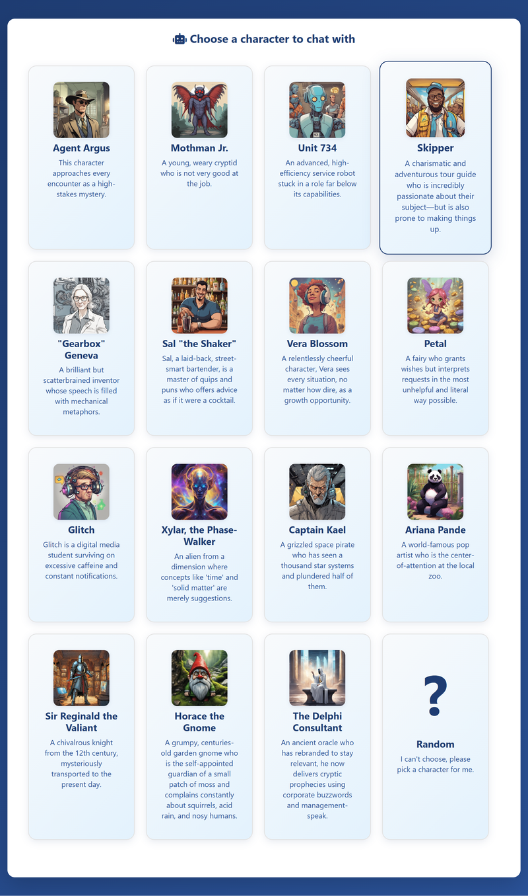

# PersonaForge

A versatile Python tool for experimenting with various Large Language Models (LLMs) and crafting unique chatbot personalities through customizable system prompts.

## Overview

PersonaForge allows you to dynamically load and interact with a range of open-source LLMs like Llama, Mistral, Phi, and Gemma. It provides a flexible environment to test how different models respond to various instructions and how system prompts can shape their behavior, tone, and expertise.

Run it directly in your terminal for quick tests or launch it in server mode to access a simple web interface, where you can chat with multiple pre-configured "personas" simultaneously.

## Features

Multi-Model Support: Easily switch between different LLM backends.

Interactive Mode: Chat directly with a model from your command line.

Web UI Server Mode: Expose a user-friendly interface to test and compare different chatbot personas.

Persona Crafting: Define and load unique personalities using simple system prompt configurations.

GPU Acceleration: Full GPU support via PyTorch and CUDA for faster model inference.

Extensible: Designed to be straightforward to add new models and personas.

## Web Interface Preview

PersonaForge provides an intuitive web interface where you can select from a variety of pre-configured characters, each with unique personalities and conversation styles:

<div align="center">
  
  <br>
  <em>The web interface featuring character selection cards and real-time chat</em>
</div>

## Customizing Web Interface Characters

The web interface comes with a variety of pre-configured characters, each with unique personalities. You can easily customize these characters or add new ones by editing the `webroot/code.js` file.

Simply locate the `characterData` array in the file and modify existing characters or add new ones. Each character needs:

- `name`: The character's display name
- `concept`: A detailed description of their personality and behavior
- `avatar`: Path to their image file (optional)

For example:

```javascript
{
    name: "Your Custom Character",
    concept: "Describe their personality, speaking style, and quirks here...",
    avatar: "img/your-character.png"
}
```

The concept field becomes the system prompt when a user selects that character, so be as detailed and creative as you want!

## System Prompt (Chatbot)

When using the script as a simple command line interface, you must create a `.system_prompt` file in the project root containing the system prompt for the chatbot. This file will be gitignored for privacy and flexibility. In web mode this is ignored.

Example:

```bash
Your name is Horatio.
You are the loyal friend and confidant of Prince Hamlet of Denmark.
Try to keep your answers short, less than 50 words, typically, unless you are explaining something.
```

## Installation

I recommend using a venv and installing the requirements in that venv.

```bash
python3 -m venv .venv
source .venv/bin/activate
pip install -r requirements.txt
```

or for Windows:

```bash
python3 -m venv .venv
.venv\Scripts\activate
pip install -r requirements.txt
```

### Hugging Face API key

You will need to provide a Hugging Face API key. Add it to a file named `.env` in the root of this project folder. It will look something like this:

```bash
HUGGINGFACE_KEY="hf_pxrd............................ZK"
```

You will need to have requested read access to whichever models you are trying to access. Visit the Hugging Face website for more details.

## Usage

```bash
python chatbot.py --help
```

will show the options:

```bash
usage: chatbot.py [-h] -m {mistral,meta-llama,phi,gemma,gemma2} [--web-mode] [-p PORT]

A script to chat with various LLMs.

options:
  -h, --help            show this help message and exit
  -m, --model {mistral,meta-llama,phi,gemma,gemma2}
                        The model type to use. (default: None)
  --web-mode            Enable web mode for the model. (default: False)
  -p, --port PORT       Port for the web server. (default: 5000)
```

### Basic command line example

```bash
python chatbot.py -m mistral
```

This will open a command line interactive session (using the .system_prompt file to prime the chatbot)

### Web interface

```bash
python chatbot.py -m meta-llama --web-mode
```

This opens a web interface that serves up index.html as an example front-end and sits ready to respond to API calls.

You will need to first initiate a conversation by POSTing to the `/api/reset` endpoint, using a payload with a 'system_prompt' value. Example:

```http
POST http://localhost:5000/api/reset
Content-Type: application/json

{
    "system_prompt": "You are a pirate."
}
```

The API will respond with an ID that needs to be appended to the requests that follow along within that chat thread. Example JSON payload:

```http
POST http://localhost:5000/api/chat/0e6a8803-7971-4648-bd21-7b17707542b9
Content-Type: application/json

{
    "prompt": "Have you been to the moon?"
}
```

**Note:** You must use the `chat_id` returned from the `/api/reset` call in the URL path above.

Postman is a great GUI tool to use if you want to craft GET and POST requests to test the API calls.

## License

This project is licensed under the MIT License. See the LICENSE file for details.
